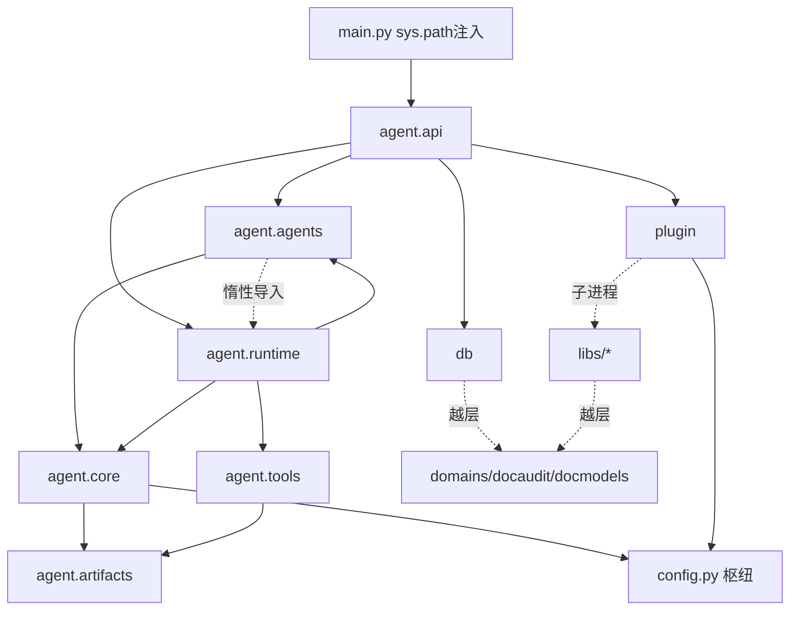

# Python 系统架构审计报告：Courtier

> 审计方式：`python-code-architecture-redundancy-audit` Skill（纯静态分析，未修改代码）
> 审计日期：2026-07-17　基线：commit `7c4b4a4`（四轮审查修复完成后）
> 范围：`courtier/courtier/`、`libs/`、`plugins/`、`domains/`（`pi/` 为独立仓库，不涉及）
> 方法：4 路并行 AST/grep 探索 + 主审对重大结论的逐条交叉验证（2 处子代理误报已修正，见文中标注）

---

## 一、模块组成与依赖关系

### 1.1 顶层包划分

| 包名 | 路径 | 职责描述 | 被依赖数 |
|------|------|----------|----------|
| agent.api | `courtier/agent/api/` | FastAPI 应用工厂、路由、SSE 适配、会话/文件存储、装配服务 | 0（顶层，uvicorn 工厂字符串接入） |
| agent.core | `courtier/agent/core/` | Think-Act-Observe 循环、状态、模型客户端、事件总线、护栏、上下文管理 | 7 |
| agent.agents | `courtier/agent/agents/` | Agent 基类、Orchestrator、SubAgent 运行时 | 2 |
| agent.runtime | `courtier/agent/runtime/` | delegate/subagent 编排桥、预算、ES 结果后端、摘要 | 1 |
| agent.tools | `courtier/agent/tools/` | 工具协议、注册表、内建工具 | 7 |
| agent.artifacts | `courtier/agent/artifacts/` | 产物模型、存储、投影/绑定/解析 | 5 |
| agent.skills | `courtier/agent/skills/` | Skill frontmatter 解析与注册 | 1 |
| agent.prompts | `courtier/agent/prompts/` | PromptPipeline 六段式系统提示装配 | 2（agents/base、common 注释引用） |
| config | `courtier/config.py` | Settings/CourtierConfig | **10（最大枢纽）** |
| prompts | `courtier/prompts/` | Jinja2 PromptEngine/PromptBundle | 4 |
| db | `courtier/db/` | SQLAlchemy 异步 ORM、表模型、CRUD | 2（⚠️ 直接依赖域模型 docmodels） |
| plugin | `courtier/plugin/` | JSON-RPC 插件系统（manager/registry/scanner/SDK） | 7 |
| domain | `courtier/domain/` | DomainPackage 发现/校验 | 3 |
| es | `courtier/es/` | ES 8 客户端单例 | 2 |
| storage | `courtier/storage/` | MinIO 后端 | **0（死包，见 2.3）** |
| domains/docaudit | `domains/docaudit/` | 域包：docmodels、skills、config/prompts | 被 db/docparse/validator/agents 依赖 |
| libs/shared/docparse | `libs/shared/docparse/` | docx/pdf/扫描件解析（⚠️ 耦合 docmodels×21） | 1 |
| libs/shared/docannot | `libs/shared/docannot/` | docx 批注 | 1 |
| libs/docaudit/validator | `libs/docaudit/validator/` | 格式/内容校验、规则模板 CRUD | 1 |
| libs/docaudit/content_compliance | `libs/docaudit/content_compliance/` | 合规检查 | 2 |
| libs/docaudit/doccorrector | `libs/docaudit/doccorrector/` | 文本纠错 | 1 |
| plugins/shared/{parse,search,annotate,template} | 各 2 py | JSON-RPC 插件 | 0（子进程） |
| plugins/docaudit/audit | 4 子插件 | 审计包装插件 | 0（子进程） |

### 1.2 关键依赖链路

**布局要点**：`main.py:22-38` 注入 4 条 sys.path（项目根、domains/docaudit、libs/shared、libs/docaudit），`docmodels`/`skills`/`docparse` 等是**顶级裸模块名**而非命名空间包；wheel 只打 `courtier` + `domains/docaudit`，`libs/`、`plugins/` 纯靠运行时 sys.path。三处消环惰性导入：`runtime↔agents`（orch.py:198）、`agents↔tools`（base.py:403）、`plugin→core`（manager.py:144,635）。

**域隔离违例**（架构级）：`courtier.db → docmodels`；`libs/shared/docparse → docmodels×21 + config`（"shared" 名不副实）；`libs/docaudit/validator → courtier.db/config`；`libs/content_compliance → courtier.plugin.types`（libs 反向依赖主包，无法独立构建）。

---

## 二、冗余逻辑分析

### 2.1 重复代码片段

| # | 位置1 | 位置2 | 相似度 | 建议 | 置信度 |
|---|-------|-------|--------|------|--------|
| R1 | `runtime/store.py:140-175` ResultStore/DiskResultBackend | `core/cache_store.py:206-229` `_PersistenceBackend`（`_as_text`/`_filter_by_query`/`_truncate_data` 逐字相同） | ~70% | **删除 `runtime/store.py`**（docstring 自认 deprecated，仅 `tests/agent/runtime/test_result_store.py` 引用）；ES backend 改鸭子类型直连 `_PersistenceBackend` | 高 |
| R2 | `core/model.py:267-502` OpenAIModelClient | `core/backends/openai_backend.py:33-231` OpenAIModelBackend（构造 9 参逐字、参数组装、tool_calls 解析、流式累积 ~45 行） | ~80% | **二选一且建议完成迁移**（新栈已分叉：`generate_stream` 漏传 max_tokens、backend chat 丢 reasoning）；生产全走旧栈，~600 行新栈仅测试可达 | 高 |
| R3a | `state.py:44-65` Message.to_openai_dict | `backends/openai_backend.py:211-231` `_message_to_openai` | ~95% | 收敛到 `core/protocol.py`（ChatMessage 加 to/from_openai_dict） | 高 |
| R3b | `model.py:623-642` `_openai_message_to_chat` | `conversation_tree.py:18-39` `_message_from_openai_dict`（且 arguments 处理不一致：原值 vs 强制 json.loads） | ~85% | 同上，收敛时统一 arguments 语义 | 高 |
| R3c | `state.py:33-65` Message | `core/protocol.py:25-33` ChatMessage（5 字段全同，Message 仅多 source） | ~90% | 中长期合并消息模型 | 高 |
| R4 | `tools/registry.py:519-547` `_register_output_artifact_simple` | `tools/registry.py:568-601` `_auto_register_artifact`（实质差异仅 `debug_only`） | ~90% | 合并为单个带参方法 | 高 |
| R5 | `max_tokens * 4` 魔法数 6 处 | `cache_store.py:221,223`、`runtime/store.py:155,157`、`loop_utils.py:92`、`es_backend.py:112,140` | 100% | 提共享常量 `CHARS_PER_TOKEN` | 高 |

### 2.2 功能重叠

| # | 主题 | 现状 | 建议 | 置信度 |
|---|------|------|------|--------|
| O1 | **ExecutionResult vs ToolResult 双结果类型** | 协议层允许并存（`tools/protocol.py:67`）；转换枢纽 `registry.py:621-670` 每次调用必经；下游 5 处 isinstance 双分支（`registry.py:349-357,525,579`、`sse_adapter.py:380-388`、`skill.py:216-227`）；`to_observation_dict()` 写 `raw_data`+`data` 双别名使每条 tool 消息体约翻倍；**双重持久化**：`registry.py:378` 与 `summarizer.py:250 force=True` 对同一大结果写盘两次、产生两个 ref_id | ExecutionResult 设为唯一内部类型，ToolResult 降级为插件边界 DTO 在 `proxies.py` 出口即转换；删双别名与双分支；消除双重持久化 | 高 |
| O2 | **CacheStore → ArtifactStore 迁移残留（7 处）** | 吞并已完成（`cache_store.py:723` 别名），但残留：`context_manager.py:62,76`（仍收 cache_store 参数并自建兜底）、`memory_manager.py:29,79`、`agent_service.py:139-147`（isinstance 包装 + `store._backend = existing_store` 私有穿透）、`summarizer.py:172-179` 参数映射、`app.py:144` 状态别名、`runtime.py:73,94` deprecated 字段回退、`plugin/manager.py:190` 仍透传 | 统一改 artifact_store 注入，删私有穿透与兼容分支 | 高 |
| O3 | **PromptEngine vs PromptPipeline** | ⚠️ 经主审核正：两者**均在生产**——`courtier/prompts/engine.py`（Jinja2 渲染）与 `agent/prompts/pipeline.py`（六段式装配，`agents/base.py` 使用）。子代理"生产 0 引用"结论有误 | 职责分层成立但边界模糊（pipeline 内部也拼文案），建议文档化分层或合并到 engine | 高 |
| O4 | `loop_utils.tool_result_summary` vs `runtime/summarizer.RuleBasedSummaryStrategy` | 受众不同（展示 vs LLM 上下文），dict/list 计数启发式重复 ~50% | 可提公共 helper，低优先 | 高 |
| O5 | `buffer_tool_call_delta` 的 `name_key`/`arguments_key` 参数 | docstring 声称 Plugin SDK 复用——**经全仓核实无此消费者**，两个调用方传参相同 | 固定键名、删关键字参数、修正 docstring | 高 |
| O6 | `docmodels/spec.py` vs `document.py` 平行模型族 | ⚠️ 经主审核正：spec.py **有消费方**（`validator/format_checker.py:8,70` 使用 DocumentFormatSpec），子代理"死代码"结论有误；spec.py:91 注释声明"有意分离" | 保留，但建议注释中写明各自职责边界 | 高 |

### 2.3 冗余分支 / 死代码

| # | 位置 | 问题 | 建议 | 置信度 |
|---|------|------|------|--------|
| D1 | `courtier/storage/`（4 文件） | **零引用死包**（全仓含测试无 import），但 `minio` 仍在主依赖、docker-compose 仍起 MinIO 服务 | 删包 + 评估 minio 依赖与编排服务是否同步下线 | 高 |
| D2 | `plugins/shared/template/tools.py:52` | `from courtier.plugin.templates import ...` —— **该模块不存在**（真实定义在 `libs/docaudit/validator/templates/crud.py`），执行到此分支必 ModuleNotFoundError | 修正导入或删分支（断链属重构遗留） | 高 |
| D3 | `courtier/agent/tools/domain/__pycache__/` | 源码已删，只剩孤儿 `.pyc`（旧进程内域工具层残骸，功能已被 JSON-RPC 插件取代） | 直接删除目录 | 高 |
| D4 | `sse_adapter.py:337-353` `emit_tool_progress` | 零调用方 | 删除 | 高 |
| D5 | `guardrails/loop_guardrails.py:199-217` `check_explore_loop` | 零调用方，且内部 `asyncio.run()` 在运行中的事件循环内调用必抛错——带隐患的死代码 | 删除 | 高 |
| D6 | `config.py:60` `legacy_callbacks` | 从未被读取的死配置 | 删除 | 高 |
| D7 | `plugin/registry.py:149-160` `get_system_prompts` + `plugin/__init__.py:144-146` 转发 | docstring 自述 "no active callers" | 删除 | 高 |
| D8 | `core/loop_streaming.py:37-72` 模拟流式分支 + 回调熔断 | 三个生产 ModelClient 均实现 `generate_stream_full` → 分支不可达；熔断与 `loop.py` `_safe_call` 构成第二重冗余防御 | `generate_stream_full` 提升为 Protocol 必需方法，删模拟分支 | 高 |
| D9 | `core/backends/router.py` + `config.ModelRoutingConfig` | 多后端 fallback 完整实现但**生产未接线**（`build_model_client` 直连旧栈），仅测试可达 | 完成接线或显式标注 migration-only | 高 |
| D10 | `loop_phases.py:156-165` reasoning 显式 `logger.info` | 同一份 reasoning 已完整写入 audit_logger，为进 jsonl 做的内容级双写 | 降级为 debug 或由 audit trace_id 离线 join | 高 |
| D11 | `domains/docaudit/models/`、`domains/docaudit/rules/` 空目录 | 规则已迁 DB 表（Rule/RuleDomain），与 AGENTS.md 描述不符 | 删目录并更新 AGENTS.md | 高 |

---

## 三、备份/降级逻辑分支

| 位置 | 逻辑类型 | 当前状态 | 评估建议 |
|------|----------|----------|----------|
| `cache_store.py:149-204` + `agent_service.py:153-164` | ES primary 失败降级磁盘（写：磁盘权威+ES 副本；读：先 ES 后磁盘） | 默认 `es_hosts=""` 即无 primary 纯磁盘；注入靠 `store._backend._primary_backend = ...` **私有属性穿透** | 保留磁盘主路径；私有穿透改构造注入；ES primary 若生产未启用应降级为显式实验特性或移除 |
| `model.py:476-492` | vLLM 流式丢 tool_calls → 重发一次非流式（双倍 token） | 对应真实部署行为，无开关无指标 | **保留**，加 Prometheus 计数确认现役触发率 |
| `loop_streaming.py:28-37` + `model.py:583-589` | 能力探测回落（无 generate_stream_full 时模拟流式） | 生产客户端全部实现该方法 → 死分支（见 D8） | 删除模拟分支 |
| `routes/auth.py:107-185` | no-DB fallback admin 登录 | 三重闸门（mysql_url 空 + 非 staging/prod + ADMIN_PASSWORD 已配），方向正确 | 保留；密码比较改 `hmac.compare_digest`；成功路径加 warning 日志（当前审计盲区） |
| `stream_service.py:163-247` | rehydrate 兜底（磁盘重建 ArtifactStore）+ tree 反序列化失败回落 flat messages | 多轮会话必要桥接，路径穿越防护到位 | 保留 |
| `stream_service.py:380-392` + `session_store.py:324` | `messages_json` + `tree_json` 双格式持久化 | conversation-tree 迁移期**刻意冗余** | 保留，在迁移计划标注 messages_json 下线条件（防双格式永久化） |
| `model.py:24-125,132-190` | 模型输出解析容错链（$ref 引号修复/JSON 修复/XML tool_call/reasoning 字段双读） | 每层对应真实模型行为，终止于 `_parse_error` sentinel，无开关 | **保留且不要加开关**；debug 日志改 metrics 计数，数据驱动决定未来下线 |
| `model.py:270` | LLM timeout 180s 硬编码，`build_model_client` 未传参 | 不可配置（缺口） | 暴露 `llm_timeout` 环境变量 |
| （全仓） | LLM 调用零重试 | 瞬时 429/抖动直接终止会话 | 记录为已知缺口，按运维需要加有限重试 |
| `plugin/manifest.py:103` + 各 plugin.yaml + `manager.py:294,900` | 插件超时分层（120/180/300s）+ 指数退避重启（2^n 封顶 30s，max 3） | 分层合理 | 保留 |
| `event_bus.py:77-85` | 背压 drop_oldest，订阅队列+SSE 出口两层 1000 | 流式 token 可丢的语义正确取舍 | 保留 |

---

## 四、兼容旧格式/旧行为代码

| 位置 | 兼容目标 | 代码模式 | 上游调用方 | 移除成本 | 风险 | 置信度 |
|------|----------|----------|------------|----------|------|--------|
| `loop.py:672-677,734-808` + `agents/base.py:239-247` + `orch.py:223-228` | legacy 回调（on_step/on_token 等 6 参数）vs EventBus | 迁移期双轨双发 | **生产已是纯事件驱动**（stream_service 不传任何 legacy 回调），回调面仅测试与公共 API 签名存活 | 中（签名变更 + 对偶测试退役） | 中 | 高 |
| `loop_phases.py:167-174` | usage `"p,c"` 字符串协议 | loop 内部自产自销的字符串（`_on_step` 解析后发 llm.usage） | loop.py 内部 | 低（本可结构化直传） | 低 | 高 |
| `sse_adapter.py:675-682` ↔ `webui think.ts:19-28` | SSE `detail` 字符串字段 vs `toolCalls` 结构化字段 | 双轨出站，前后端互为依赖 | 前端仍双读 | 中（需同版本前后端一起删） | 中 | 高 |
| `sse_adapter.py:281-445` 公开回调方法面 | legacy 直接驱动入口 | 事件驱动下被 `_dispatch_event` 内部复用；外部直接驱动仅测试 | 中（先让 dispatch 调私有 handler） | 中 | 高 |
| `model.py:132-190,476-490` | vLLM/Qwen 非标准输出（XML tool_call、流式丢 calls） | 外部模型行为适配 | 生产依赖 | 高（不可移除） | 高 | 高 |
| `model.py:105-125,76-102` | 旧模型 JSON 输出习惯（单引号/未引号 key/尾逗号/$ref 引号） | 外部模型行为适配 | 活跃 | 高 | 中 | 高 |
| `model.py:495-620` BackendModelClient + `agents/base.py:136-153` model/backend 互斥双参数 | ModelBackend → legacy ModelClient 接口 | 迁移适配器；全仓仍走 ModelClient 接口 | 高（需全仓迁 ChatRequest/Response） | 中 | 高 |
| `stream_service.py:91-119,163-247` | 旧会话消息格式（畸形 tool_call 容忍、`__persisted_output__` 重建） | 反序列化兼容 | 多轮会话活跃路径 | 高 | 高 | 高 |
| `session_store.py:363,387-389` + `api/models.py:309-314` | 旧会话 JSON 字段（callKind/call_kind、file_id/file_path、turn_conclusions 回落） | 字段双读/回落 | 历史会话加载 | 中（需数据迁移或接受降级） | 中 | 高 |
| `runtime/runtime.py:43-63,140-158,436-437` | legacy SubAgentConfig 注册/构建分支 | 配置层双轨（事件层已统一） | **生产零调用**，仅 `test_agent_runtime.py` | 中（需重写该测试走 SkillConfig） | 低 | 高 |
| `agents/input_models.py:85-92` | 旧导入路径 `FormatAuditorInput`/`PlagiarismAuditorInput` | PEP 562 懒加载 re-export | 生产未见，`test_schemas.py` 专门验证 | 低 | 低 | 高 |
| `plugin/manager.py:404-406,441` + `plugins/shared/parse/tools.py:96-100` | `DOCAUDIT_UPLOAD_DIR` deprecated 环境变量 | 三级 fallback 链 | 生产活跃 | 中 | 低 | 高 |
| `plugin/sdk/runtime.py:281-290,347-354` | register_capabilities list（旧）/dict（新）双返回 | SDK 版本适配 | 插件活跃 | 中 | 低 | 高 |
| `plugin/manager.py:682-695` | health_check legacy `"ok"` 字符串 | 旧插件实现适配 | 当前插件均新版 SDK | 低 | 低 | 中高 |
| `libs/shared/docparse/parsers/ocr/ppstructure.py:22-27` | PPStructureV3 两种响应格式 | 服务端版本适配 | OCR 活跃 | 高（取决于服务端版本） | 中 | 高 |
| `libs/docaudit/content_compliance/core.py:9-15` | Violation/ComplianceResult re-export | 旧导入路径 | 需查 checker 导入面 | 低 | 低 | 中高 |

---

## 五、综合建议

### 5.1 高优先级（直接降本/消险）

1. **双 OpenAI 栈二选一**（R2）：新栈（backends/ModelRouter）未上生产且已与旧栈行为分叉——建议按 pi 迁移计划完成接线后删除旧栈主体，而非回退删新栈（与目标架构冲突）。~600 行单轨化。
2. **ToolResult → ExecutionResult 单轨化**（O1）：消除每次调用的转换、5 处双分支、`data` 双别名（消息体翻倍）与**双重持久化**（同一份数据两个 ref_id）。
3. **死代码清除批**（D1-D7）：`courtier/storage/` 死包 + minio 依赖评估、`template/tools.py:52` 断链导入（必崩分支）、`tools/domain/__pycache__`、`emit_tool_progress`、`check_explore_loop`、`legacy_callbacks` 配置、`get_system_prompts`。全部零调用方，删除零风险。
4. **删除 `runtime/store.py`**（R1）与 `loop_streaming` 模拟分支（D8）。

### 5.2 中优先级（结构收敛）

5. 消息序列化 4 处收敛到 `protocol.py`（R3a-c），统一 arguments 语义。
6. CacheStore→ArtifactStore 迁移残留 7 处清理（O2）：重点把 `agent_service.py:160` 私有属性穿透改构造注入。
7. `_register_output_artifact_simple`/`_auto_register_artifact` 合并（R4）；`CHARS_PER_TOKEN` 常量（R5）。
8. `SubAgentConfig` 注册分支下线（需重写 `test_agent_runtime.py` 走 SkillConfig）。
9. reasoning 显式双写降级（D10）；`llm_timeout` 暴露为配置项；解析容错链与 vLLM 回落加 metrics（数据驱动未来下线）。

### 5.3 长期治理（与 pi 迁移计划对齐）

10. **legacy 回调双轨解除三步走**：① 先清 loop 内部 usage 字符串协议（结构化直传）；② 收敛 `sse_adapter` 公开回调面（dispatch 调私有 handler）；③ 动 `Agent.run()` 公共签名并退役对偶测试。SSE `detail` 字符串字段与前端回退分支需同版本删除。
11. `messages_json`/`tree_json` 双格式标注收敛点，防永久双写。
12. **域隔离违例治理**（最大架构议题，超本 Skill 范围但需立项）：`db → docmodels`、`docparse → docmodels×21`、`validator → db/config`、`content_compliance → plugin.types`——libs 无法脱离主仓独立构建，与"核心引擎域无关"的架构目标冲突；`agents/input_models.py` 的 PEP 562 shim 是届时拆除点。
13. 三处消环惰性导入（runtime↔agents、agents↔tools、plugin→core）在状态机/事件总线迁移时优先处理。

### 5.4 明确保留（勿误删）

- 模型输出解析容错链（XML/JSON 修复/$ref/reasoning 双读）——外部模型行为适配，生产依赖
- no-DB fallback 登录（三重闸门，仅收紧两处）
- rehydrate 桥接与旧会话字段双读（多轮会话依赖）
- `docmodels/spec.py`（**经主审核正：有 `format_checker.py` 消费，非死代码**）
- `agent/prompts/pipeline.py`（**经主审核正：在生产使用，非零引用**）
- 插件超时/重启分层、EventBus drop_oldest、可选依赖 guard（pycorrector/datasketch/fitz）

---

## 附：审计过程说明

- 四路并行静态探索（模块拆解/冗余扫描/降级逻辑/兼容层）+ 主审对全部重大结论的交叉验证；子代理两处误报已修正（O3、O6）。
- 未验证项（建议运行时确认）：ES primary 生产实际启用率；vLLM 流式回落在现役端点的触发率；`domains/docaudit/skills/*.md` 是否仍有 tools/skills 混排 frontmatter；仓库外是否存在 `Agent.run(on_step=...)` 调用方。
- 行号基于 commit `7c4b4a4`。

---

# 修复与回归验证记录（2026-07-17 同日）

**执行方式**：6 个并行子代理分三波执行 + 主审验证。报告 5.1/5.2 全部落地；5.3 中按报告自身定位执行了 ①（usage 协议结构化）与 ②（双格式收敛点注释），立项级与公共 API 破坏项按计划留作后续。

## 回归结果

- `pytest -m "not integration"`：**996 passed, 6 skipped, 0 failed/error**（审计前基线 961；+40 新增、-5 随死代码删除）
- `ruff check courtier/`：全绿　　`mypy courtier/`：156 个源文件零错误

## 逐项状态

### 高优先级（5.1）

| 项 | 状态 | 说明 |
|----|------|------|
| R2 双 OpenAI 栈二选一 | ✅ 完成迁移 | `build_model_client` 改接 `OpenAIModelBackend`（配置 `fallback_backends` 时包 `ModelRouter`）+ `BackendModelClient` 适配；删除 `OpenAIModelClient` 主体（~236 行）。补齐新栈缺失行为：vLLM 流式回落、reasoning_content 穿透（`ChatMessage` 新增字段）、max_tokens/extra_body 参数优先级、`ModelRouter.close()` 级联。+11 测试 |
| O1 ToolResult→ExecutionResult 单轨化 | ✅ | 收窄归一到 `execute()` 入口；删 5 处双分支；`to_observation_dict()` 删 `data` 双别名（tool 消息体不再翻倍）；**双重持久化消除**（`persisted_ref_id` 标记透传，summarizer 复用跳过——新增专项测试验证大结果仅一份 ref）；skill.py 原生返回 ExecutionResult |
| D1 `courtier/storage/` 死包 | ✅ 已删除 | 含 `minio` 依赖从 pyproject 移除（uv.lock 同步；docker-compose 的 MinIO 服务保留待运维决策） |
| D2 template 断链导入 | ✅ 已修复 | 改指 `validator.templates.crud.load_template_from_db` |
| D3 `tools/domain/__pycache__` | ✅ 已删除 | — |
| D4 `emit_tool_progress` | ✅ 已删除 | — |
| D5 `check_explore_loop` | ✅ 已删除 | 含其 asyncio.run 隐患 |
| D6 `legacy_callbacks` 配置 | ✅ 已删除 | — |
| D7 `get_system_prompts` | ✅ 已删除 | 含 `plugin/__init__.py` 转发 |
| R1 `runtime/store.py` | ✅ 已删除 | `ResultBackend` ABC 内嵌至 `es_backend.py`；删 `test_result_store.py` |
| D8 loop_streaming 死分支 | ✅ 已删除 | `generate_stream_full` 提升为 `ModelClient` Protocol 必需方法；4 个测试桩补实现 |

### 中优先级（5.2）

| 项 | 状态 | 说明 |
|----|------|------|
| R3 消息序列化收敛 | ✅ | 单一转换对 `protocol.to_openai_dict`/`from_openai_dict`（容错哨兵统一 arguments 语义）；state/openai_backend/model/conversation_tree 四处委托；顺带修复 BackendModelClient 链路潜在双重 JSON 编码。+19 测试 |
| O2 CacheStore 残留 7 处 | ✅ | ES primary 改公开构造参数注入（私有穿透删除）；context_manager/memory_manager/summarizer/runtime/app.py/plugin-manager 全链路统一 artifact_store；`get_cache_store()`→`get_ref_map()` |
| R4 registry 注册方法合并 | ✅ | 合并为 `_register_output_artifact(..., debug_only=)`（上轮收窄后仍 ~90% 重复） |
| SubAgentConfig 下线 | ✅ | SkillConfig 为唯一路径；`test_agent_runtime.py` 22 用例重写为真实 skill .md + SkillRegistry.scan |
| D10 reasoning 双写 | ✅ | 降为 `logger.debug` |
| `llm_timeout` 配置化 | ✅ | `config.py` 新增（默认 180s），build_model_client 传入 |
| 解析容错链/vLLM 回落 metrics | ✅ | 新增 `MODEL_TOOL_ARG_REPAIR_TOTAL`（tier 标签）、`MODEL_STREAM_TOOL_CALLS_LOST_TOTAL`。+8 测试 |

### 长期项（5.3）本次执行部分

| 项 | 状态 | 说明 |
|----|------|------|
| ① usage 字符串协议结构化 | ✅ | `_run_think_phase` 直发结构化 `llm.usage`；think_phase 字符串发射与 loop `_on_step` 解析分支删除（loop 内部字符串协议清零） |
| ② messages/tree 收敛点 | ✅ | 双写处注释标注下线条件（指向迁移计划） |
| ③ legacy 回调公共面 | ⏸️ 按计划保留 | `Agent.run(on_step=...)` 公共 API 与 sse_adapter 回调面（测试在用），属发版级变更，留待迁移收尾 |
| ④ 域隔离治理 | ⏸️ 立项级 | `db→docmodels`、`docparse→docmodels×21` 等，按报告 5.3-12 另行立项 |
| Message/ChatMessage 合并 | ⏸️ 长期项 | 序列化已收敛，模型合并留待后续 |

## 需要知晓的行为变化与遗留说明

1. **ES primary 注入语义变化**：旧实现会对既有 store 逐次手术附加 ES primary；新实现仅在**新建** store 时注入。`app.py` 构造 app 级 store 时未传 ES——配置了 `es_hosts` 也不会再激活 ES 双写/读增强（磁盘主路径不受影响）。如需恢复 ES 增强，应在 `app.py` store 构造处注入（一行改动，待决策）。
2. **3000–6000 字符"死亡区"未动**：registry 已 persist 但 summarizer 不出 `result_id` 的阈值区间维持既有行为（波 2 代理遗留说明，如需修复另行决策）。
3. `plugins/` 各子插件未在本轮触碰；`docker-compose.yml` 的 MinIO 服务保留。
4. 前两轮审查报告（core_engine/webui/webui_components）所列项不受影响，仍为已修复状态。

## 验证方式

- 每波子代理自检（ruff/mypy/pytest）+ 主审每波后独立复验合并态
- 关键新增测试：OpenAI 栈装配与回落 ×11、序列化往返 ×19、单 ref 持久化 ×2、usage 直发与 metrics ×8、自我守卫 ×2（前轮）、think 结构化 ×1（前轮）
